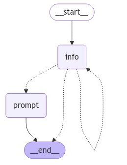
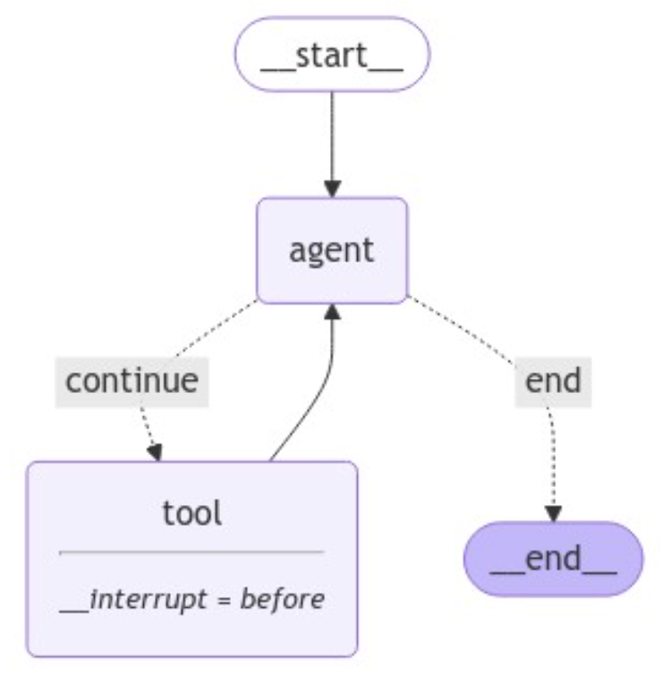

# Agent that creates prompts for me

## Function. To gather information for creatubg prompts

```python
class PromptInstruction(BaseModel):
    """Instruction on how to prompt the LLM."""

    objective: str
    variables: List[str]
    constraints: List[str]
    requirements: List[str]
    
def get_messages_info(messages):
    return [SystemMessage(content=template)] + messages

def info_chain(state):
    messages = get_messages_info(state["messages"])
    response = llm_with_tool.invoke(messages)
    return {"messages": [response]}

template = """Your job is to get information from a user about what type of prompt template they want to create.

You should get the following information from them:

- What the objective of the prompt is
- What variables will be passed into the prompt template
- Any constraints for what the output should NOT do
- Any requirements that the output MUST adhere to

If you ar not able to discern this info, ask them to clarify! Do not attempt to wildly quess.

After you are able to discern all the information, call the relevant tool."""

llm = ChatOpenAI(model='gpt-4o-mini', temperature=0)
llm_with_tool = llm.bind_tools([PromptInstruction])
```

## Function. Creating prompt
```python
# New system prompt
prompt_system = """Based on the following requirements, write a good prompt template:

{reqs}"""

def get_prompt_messages(messages: list):
    tool_call = None
    other_msgs = []
    for m in messages:
        if isinstance(m, AIMessage) and m.tool_calls:
            tool_call = m.tool_calls[0]['args']
            print(tool_call)
        elif isinstance(m, ToolMessage):
            continue
        elif tool_call is not None:
            other_msgs.append(m)
    return [SystemMessage(content=prompt_system.format(reqs=tool_call))] + other_msgs

def prompt_gen_chain(state):
    messages = get_prompt_messages(state["messages"])
    response = llm.invoke(messages)
    return {"messages": [response]}
```

## Conditions
```python
def get_state(state) -> Literal["prompt", "info", "__end__"]:
    messages = state["messages"]
    if isinstance(messages[-1], AIMessage) and messages[-1].tool_calls:
        return "prompt"
    elif not isinstance(messages[-1], HumanMessage):
        return END
    return "info"
```

### Graph building
<p align="center">
  
</p>

### Run
```
User (q/Q to quit):  영어 회화 초보자의 실력향상을 위해 적절한 가이드라인을 줄 수 있는 프롬프트를 작성해줘.
================================== Ai Message ==================================

프롬프트 템플릿을 작성하기 위해 몇 가지 정보를 더 필요로 합니다.

1. **프롬프트의 목표**: 어떤 특정한 목표를 가지고 있나요? 예를 들어, 회화 연습, 문법 개선, 어휘 확장 등.
2. **프롬프트에 전달될 변수**: 어떤 변수를 프롬프트에 포함시키고 싶으신가요? 예를 들어, 학습자의 현재 수준, 관심 있는 주제 등.
3. **출력에서 하지 말아야 할 제약 조건**: 출력에서 어떤 내용을 포함하지 않기를 원하시나요? 예를 들어, 너무 복잡한 문장 사용 금지 등.
4. **출력에서 반드시 지켜야 할 요구 사항**: 출력이 반드시 따라야 할 규칙이나 요구 사항이 있나요? 예를 들어, 간단한 언어 사용, 단계별 가이드 제공 등.

이 정보를 제공해 주시면, 적절한 프롬프트 템플릿을 작성할 수 있습니다!
User (q/Q to quit):  1. 목표 : 일정 수준의 회화 능력 달성 2. 학습자의 현재 수준, 목표 기간, 목표로 하는 수준 3. 너무 복잡하고 잘 사용되지 않는 단어, 문장 사용 금지 4. 간단한 예시를 들어서 설명, 실제로 원어민이 자주 사용하는 표현 위주의 문장 제시 등
================================== Ai Message ==================================
Tool Calls:
  PromptInstruction (call_bNGxJY4GMpSbTL6EC30KrVm8)
 Call ID: call_bNGxJY4GMpSbTL6EC30KrVm8
  Args:
    objective: 일정 수준의 회화 능력 달성
    variables: ['학습자의 현재 수준', '목표 기간', '목표로 하는 수준']
    constraints: ['너무 복잡하고 잘 사용되지 않는 단어, 문장 사용 금지']
    requirements: ['간단한 예시를 들어서 설명', '실제로 원어민이 자주 사용하는 표현 위주의 문장 제시']
{'objective': '일정 수준의 회화 능력 달성', 'variables': ['학습자의 현재 수준', '목표 기간', '목표로 하는 수준'], 'constraints': ['너무 복잡하고 잘 사용되지 않는 단어, 문장 사용 금지'], 'requirements': ['간단한 예시를 들어서 설명', '실제로 원어민이 자주 사용하는 표현 위주의 문장 제시']}
================================== Ai Message ==================================

**Prompt Template:**

---

**Objective:** Achieve a certain level of conversational ability.

**Instructions:**

1. **Current Level Assessment:** Please provide a brief description of the learner's current language proficiency level (e.g., beginner, intermediate, advanced).

2. **Goal Duration:** Specify the time frame in which the learner aims to achieve their desired level of proficiency (e.g., 3 months, 6 months).

3. **Target Level:** Indicate the target level of conversational ability the learner wishes to reach (e.g., basic conversation, fluent conversation).

4. **Constraints:** Ensure that the language used is simple and avoids overly complex or rarely used words and sentences.

5. **Requirements:** 
   - Provide simple examples to illustrate key points.
   - Focus on phrases and expressions that native speakers commonly use in everyday conversation.

**Example Response:**

- **Current Level:** Beginner
- **Goal Duration:** 3 months
- **Target Level:** Basic conversation

**Response:**
To help you achieve basic conversational ability in 3 months, we will focus on simple, everyday phrases. For example, instead of saying "I would like to inquire about the possibility of...", you can simply say "Can I ask about...?" This is a common expression used by native speakers. 

---

Feel free to fill in the details based on the learner's specific situation!
Done!
User (q/Q to quit):  q
AI: Byebye
```

</br></br>

# Agent with search, code

## Tools
```python
from langchain_core.tools import tool
from langchain_experimental.utilities import PythonREPL
from langchain_community.tools.tavily_search import TavilySearchResults

from langgraph.prebuilt import ToolNode, tools_condition

web_search = TavilySearchResults(max_results=2)
repl = PythonREPL()

@tool
def python_repl(
    code: Annotated[str, "The python code to execute to generate your chart."]
):
    """Use this to execute python code. If you want to see the output of a value,
    you should print it out with `print(...)`. chart labels should be written in English.
    This is visible to the user."""
    try:
        result = repl.run(code)
    except BaseException as e:
        return f"Failed to execute. Error: {repr(e)}"
    result_str = f"Successfully executed:\n```python\n{code}\n```\nStdout: {result}"
    return (
        result_str + "\n\nIf you have completed all tasks, respond with FINAL ANSWER."
    )

tools  = [web_search, python_repl]
tool_node = ToolNode(tools)
```

### Agent
```python
from langchain_openai import ChatOpenAI

llm = ChatOpenAI(model="gpt-4o-mini")
llm_with_tools = llm.bind_tools(tools)

def agent(state: State):
    result = llm_with_tools.invoke(state["messages"])
    return {"messages": [result]}

def should_continue(state):
    messages = state["messages"]
    last_message = messages[-1]
    if not last_message.tool_calls:
        return 'end'
    else:
        return 'continue'
```

### Graph building
<p align="center">
  
</p>

### Run
```python
initial_input = {"messages": [HumanMessage(content="LLM agent의 연구 및 개발이 어떻게 이루어지고 있는지 표로 나타내줘(현재, 2024년 11월 25일)")]}
thread = {"configurable": {"thread_id": "13"}}

async for chunk in graph.astream(initial_input, thread, stream_mode="updates"):
    for node, values in chunk.items():
        print(f"Receiving update from node: '{node}'")
        print(values)
        print("\n\n")
```
...
```
'다음은 LLM(대형 언어 모델) 에이전트의 연구 및 개발 동향에 대한 표입니다.\n\n| 날짜          | 연구/개발 진행 상황                                                                                                   | 주요 내용 및 기술                                          | 참고 자료                                       |\n|---------------|---------------------------------------------------------------------------------------------------------------------|---------------------------------------------------------|-------------------------------------------------|\n| 2024년 11월 25일 | Reflexion: 언어 에이전트의 언어 강화 학습 연구 발표                                                            | 언어 모델의 신뢰성 평가 및 향상 기술                    | [LG Research](https://www.lgresearch.ai/blog/view?seq=484) |\n| 2024년 11월 25일 | Prometheus 2 공개: 다른 언어 모델을 평가하기 위한 오픈 소스 언어 모델 개발                                     | 언어 모델 간 비교 및 평가 방법론                       | [LG Research](https://www.lgresearch.ai/blog/view?seq=473) |\n| 2024년 11월 25일 | RAG(검색 증강 생성) 기술의 부상 및 연구                                                                          | 데이터 검색 및 실시간 정보 반응 시스템 발전 전망      | [Skelter Labs](https://www.skelterlabs.com/blog/2024-year-of-the-rag) |\n| 2024년 11월 25일 | ICLR 2024 워크숍에서 LLM 에이전트 관련 연구 발표                                                               | 언어 모델의 안전성 및 효율성 증대에 관한 논의          | [OpenReview](https://openreview.net/group?id=ICLR.cc/2024/Workshop/LLMAgents) |\n\n이 표는 LLM 에이전트의 연구 및 개발이 어떻게 진행되고 있는지를 요약한 것입니다. 각 항목은 연구 내용, 기술적 접근 및 관련 자료를 포함하고 있습니다.'
```